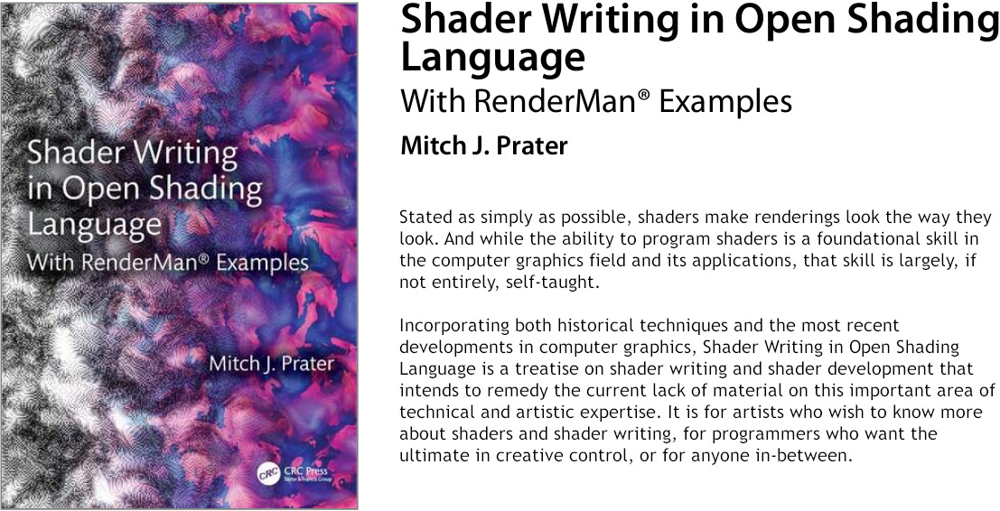

This repository contains the
[Shader Writing in Open Shading Language](https://www.routledge.com/Shader-Writing-in-Open-Shading-Language-with-RenderManr-Examples/Prater/p/book/9781032421100)
book's supplementary material.
Specifically, it contains the OSL source code for the shaders and the [make](https://www.gnu.org/software/make/) and [python](https://www.python.org/) based build system described in the book.

Documentation is in the [`doc`](doc) directory.

[Open Shading Language](https://github.com/AcademySoftwareFoundation/OpenShadingLanguage) is a project of the [Academy Software Foundation](https://www.aswf.io/projects).

[RenderMan](https://renderman.pixar.com/)&reg; is 
[Pixar's](https://www.pixar.com/)
multi-award winning rendering and application software ecosystem.

Please feel free to use the [Discussions Tab](https://github.com/mprater/ShaderWriting/discussions).
I'd love you hear what you think, or to discuss any issues or thoughts you may have about the book or this repository and its contents.

# License
This repository's content is licensed under either the

* Apache License, Version 2.0, ([LICENSE-APACHE](LICENSE-APACHE) or http://www.apache.org/licenses/LICENSE-2.0) or
* MIT license ([LICENSE-MIT](LICENSE-MIT) or http://opensource.org/licenses/MIT)

at your option.

It also makes use of open source content generously provided by 
[LAIKA](https://github.com/LaikaStudios) under these same licensing terms.

# Notice
The `osl` directory content is currently being created. This was delayed due to my development machine dying recently. Please stay tuned. I will make an announcement as soon as this repository is complete. 

Thanks for your patience!

Also, some books were shipped early without color images. If you received such a copy, please contact the publisher so they can send you a replacement.

I sincerely apologize for this inconvenience.
